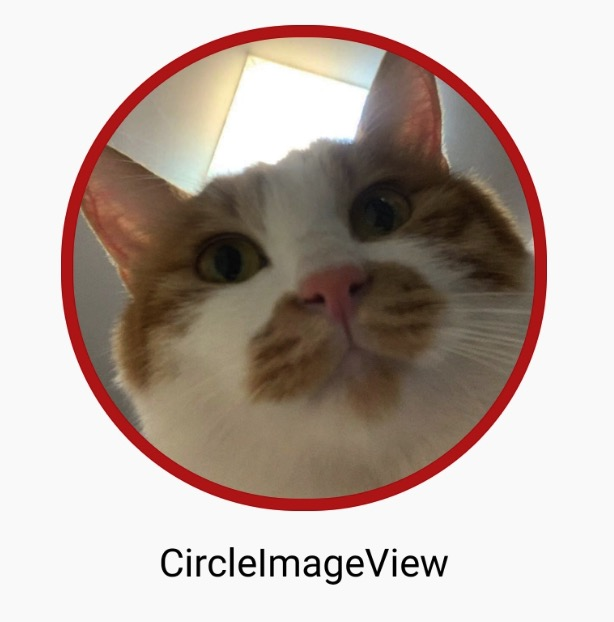
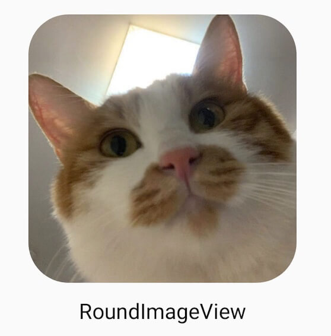
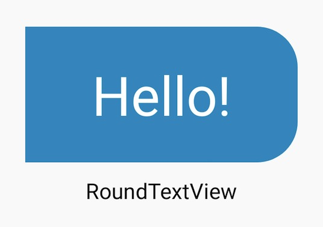
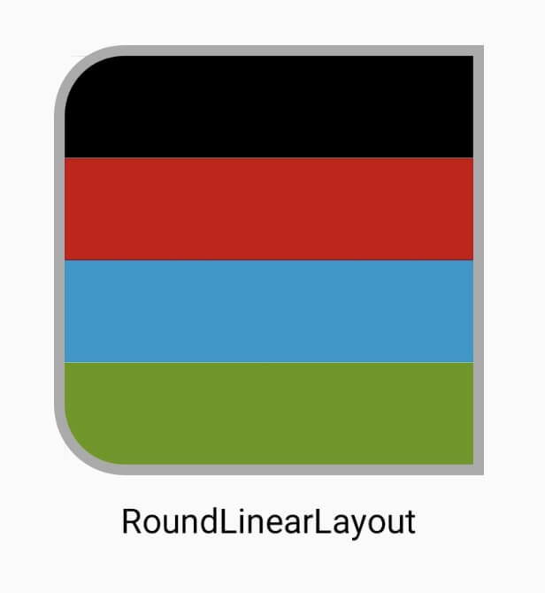
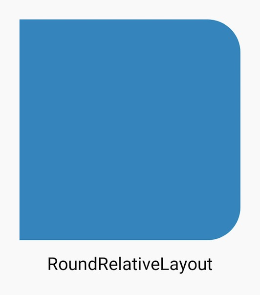
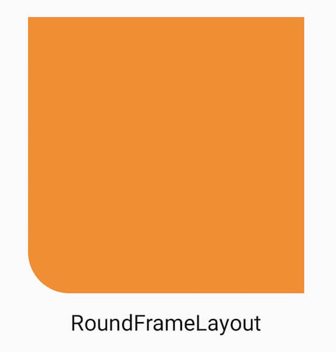
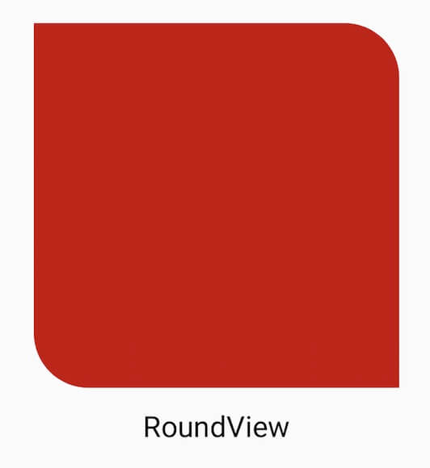

# RoundCorners

比较常用的ViewGroup和View的圆角实现，一发治好设计的圆角病。

### 该项目不再维护，请移至[RoundView](https://github.com/csdn-mobile/RoundView)

### 效果预览

||||
|---|---|---|
||||
||||

### 特点
* LinearLayout、RelativeLayout、FrameLayout、ConstraintLayout支持圆角
* ImageView、TextView、View、Button支持圆角
* CircleImageView（圆形图片）
* 支持边框
* 可正常设置ripple（波纹不会突破边框）
* 使用 **xml** 或者 **代码** 进行配置，使用简单
* ......

### 基本用法
**Step 1. 添加JitPack仓库**
在项目根目录下的 `build.gradle` 中添加仓库:
``` gradle
allprojects {
    repositories {
        ...
        maven { url "https://jitpack.io" }
    }
}
```
**Step 2. 添加项目依赖**
``` gradle
dependencies {
    // 以下二选一

    // AndroidX版本
    implementation 'com.github.KuangGang:RoundCorners:2.0.0'
    // 非AndroidX版本
    implementation 'com.github.KuangGang:RoundCorners:1.3.0'
}
```
**Step 3. 在布局文件中添加需要的RoundCorners**
```
<com.kproduce.roundcorners.CircleImageView
    android:layout_width="200dp"
    android:layout_height="200dp"
    android:src="@mipmap/ic_test"
    app:rStrokeColor="#FF3333"
    app:rStrokeWidth="5dp" />

<com.kproduce.roundcorners.RoundImageView
    android:layout_width="200dp"
    android:layout_height="200dp"
    android:scaleType="centerCrop"
    android:src="@mipmap/ic_test"
    app:rRadius="30dp"/>

<com.kproduce.roundcorners.RoundTextView
    android:layout_width="200dp"
    android:layout_height="100dp"
    android:background="@android:color/holo_blue_dark"
    android:gravity="center"
    android:text="Hello!"
    android:textColor="@android:color/white"
    android:textSize="40sp"
    app:rRightRadius="30dp" />

<com.kproduce.roundcorners.RoundRelativeLayout
    android:layout_width="200dp"
    android:layout_height="200dp"
    app:rTopRightRadius="30dp"
    app:rBottomRightRadius="30dp"
    app:rStrokeColor="@android:color/holo_green_dark"
    app:rStrokeWidth="5dp">

    <View
        android:layout_width="match_parent"
        android:layout_height="match_parent"
        android:background="@android:color/holo_blue_dark" />
</com.kproduce.roundcorners.RoundRelativeLayout>

<com.kproduce.roundcorners.RoundTextView
    android:layout_width="200dp"
    android:layout_height="100dp"
    android:background="@android:color/holo_blue_dark"
    android:gravity="center"
    android:text="Hello!"
    android:textColor="@android:color/white"
    android:textSize="40sp"
    app:rLeftRadius="50dp"
    app:rRightRadius="50dp"/>
……
```

### 支持的属性、方法
|属性名|含义|默认值|方法
|---|---|---|---|
|rRadius|统一设置四个角的圆角半径|0dp|setRadius(int radius)
|rLeftRadius|左边两个角圆角半径|0dp|setRadiusLeft(int radius)
|rRightRadius|右边两个角圆角半径|0dp|setRadiusRight(int radius)
|rTopRadius|上边两个角圆角半径|0dp|setRadiusTop(int radius)
|rBottomRadius|下边两个角圆角半径|0dp|setRadiusBottom(int radius)
|rTopLeftRadius|左上角圆角半径|0dp|setRadiusTopLeft(int radius)
|rTopRightRadius|右上角圆角半径|0dp|setRadiusTopRight(int radius)
|rBottomLeftRadius|左下角圆角半径|0dp|setRadiusBottomLeft(int radius)
|rBottomRightRadius|右下角圆角半径|0dp|setRadiusBottomRight(int radius)
|rStrokeWidth|边框宽度|0dp|setStrokeWidth(int width)
|rStrokeColor|边框颜色|Color.WHITE or #FFFFFF|setStrokeColor(int color)

### 原理浅解
[Android View的绘制流程](https://www.jianshu.com/p/5a71014e7b1b)。
View的绘制看一下这篇文章即可，代码版本比较早，但是逻辑基本相同。
1. 使用Path的addRoundRect方法，将需要剪切的圆角半径进行设置。
2. 所有View和ViewGroup的绘制都需要经过draw方法，在draw结束之后使用第一步的Path进行画布切割。
3. 注意在draw中减少创建对象次数。

### 版本记录
|版本号|更新内容|
|---|---|
|2.0.0|适配AndroidX|
|1.3.0|1.修复代码设置圆角失效等问题<br>2.升级最低版本为5.0<br>3.添加RoundConstraintLayout|
|1.1.0|边框颜色支持十六进制(#FFFFFF)|
|1.0.6|修复Oppo等5.0\5.1系统手机崩溃问题|
|1.0.4|1.代码设置圆角、边框尺寸支持浮点型<br>2.删除RoundViewPager|
|1.0.3|增加代码设置属性|
|1.0.2|1.增加边框<br>2.增加RoundButton/RoundViewPager|
|1.0.1|1.修复低版本系统圆角View黑框问题<br>2.增加CircleImageView|
|1.0.0|First Version|
